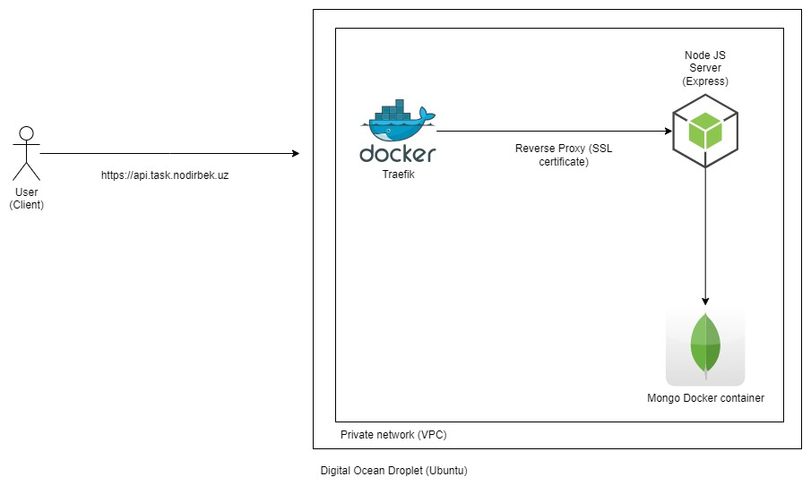

# Task management

Framework: Express JS

ODM: Mongoose

Database: Mongo

[Swagger](http://localhost:3000/api/v1/swagger)

```
http://localhost:3000//api/v1/swagger
```

## Sample users

**Admin**

E-mail

```
admin@mail.com
```

Password

```
password
```

---

**User**

E-mail

```
user@mail.com
```

Password

```
password
```

## Steps to start project locally (Docker program should be running in locally)

1. Run following command

```
docker compose up -d --build
```

2. Go to Swagger UI:

```
http://localhost:3000/api/v1/swagger
```

# Stop project locally

1. Run following command

```
docker compose down
```

## Architecture


